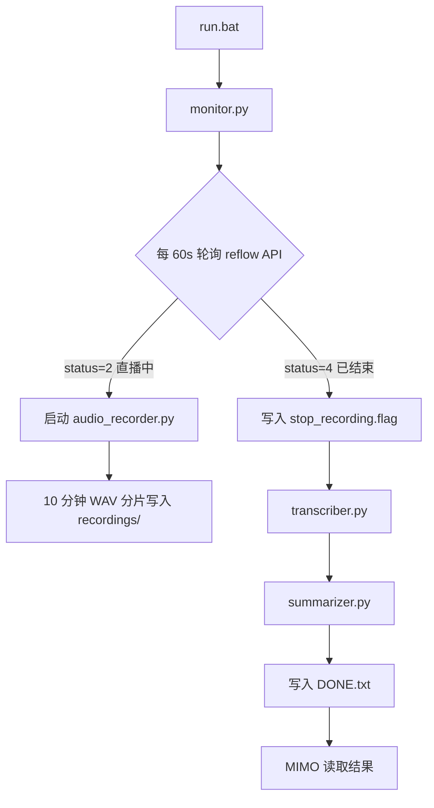

# Douyin 直播监控器

自动监控抖音直播间状态，开播时录制系统音频，下播后转写并生成会议纪要，完成后写入 `DONE.txt` 供 MIMO 等外部 Agent 轮询。

## 目录结构

```
douyin_monitor/
├── config.json           # 全部可配置项（无需改代码）
├── monitor.py            # 主控：轮询 API、调度子进程
├── audio_recorder.py     # PyAudio 系统音频录制（10 分钟分片）
├── transcriber.py        # faster-whisper 转写
├── summarizer.py         # 生成 meeting_minutes.md
├── lib_common.py         # 内部共享工具（路径/日志/磁盘清理）
├── run.bat               # 一键启动
├── install_deps.bat      # 一键安装依赖
├── requirements.txt      # 固定版本依赖
├── recordings/           # WAV 录音
├── output/               # transcript.txt、meeting_minutes.md
├── state/                # 会话状态、PID、停止信号
├── logs/                 # 按模块分日志
└── DONE.txt              # 流程完成信号（根目录）
```

默认工作目录为 `D:/mimocod/douyin_monitor`（见 `config.json` 的 `base_dir`）。若该路径不存在，则自动回退到脚本所在目录。

## 完整流程



### 1. 启动

```bat
install_deps.bat   REM 首次运行
run.bat            REM 启动监控
```

### 2. 监控 (`monitor.py`)

- 每 `poll_interval_seconds`（默认 60s）请求抖音 reflow API
- **LIVE (status=2)**：若录音未运行则启动 `audio_recorder.py`
- **ENDED (status=4)**：停止录音 → 转写 → 摘要 → 写 `DONE.txt`
- API 失败时重试 3 次；检测到限流/封禁时自动拉长轮询间隔
- 备用链路：`web/enter` API → 直播页 HTML 解析

### 3. 录音 (`audio_recorder.py`)

- 通过 PyAudio 捕获系统/环回音频（优先匹配 loopback、立体声混音等设备）
- 每 `chunk_duration_seconds`（默认 600s = 10 分钟）保存一个 WAV
- 监听 `state/stop_recording.flag` 或达到 `max_recording_hours` 自动停止
- 无音频设备时写入 `*_NO_AUDIO.marker`，后续仍生成元数据摘要

### 4. 转写 (`transcriber.py`)

- 使用 `faster-whisper` + `tiny` 模型（低内存/磁盘占用）
- 输出 `output/transcript.txt`
- 处理：无文件、损坏 WAV、静音、空转写结果

### 5. 摘要 (`summarizer.py`)

- 若配置了 `openai_api_key`：发送**短 prompt** + 转写前 **2000 字符**给 LLM
- 若无 API Key 或无转写：基于元数据（标题、时长、观看数）生成模板纪要
- 输出格式固定四节：**话题总结 / 关键观点 / 数据亮点 / 行动项**
- 结果写入 `output/meeting_minutes.md`

### 6. 完成信号

`DONE.txt` 示例：

```
DONE
session_id=20250625_143000
finished_at=2025-06-25T06:35:12+00:00
```

MIMO 检测到该文件后，可读取：

- `output/meeting_minutes.md` — 会议纪要
- `output/transcript.txt` — 完整转写
- `output/session_snapshot.json` — 场次元数据

## 配置说明 (`config.json`)

| 字段 | 说明 | 默认 |
|------|------|------|
| `base_dir` | 项目根路径 | `D:/mimocod/douyin_monitor` |
| `stream_url` | 直播间 URL | `https://live.douyin.com/...` |
| `streamer_name` | 主播名（API 无数据时备用） | — |
| `poll_interval_seconds` | 轮询间隔 | 60 |
| `audio_device_index` | PyAudio 设备索引，`null` 自动选择 | null |
| `sample_rate` | 采样率 | 44100 |
| `whisper_model_size` | Whisper 模型 | tiny |
| `max_recording_hours` | 单次最长录音 | 8 |
| `min_disk_space_mb` | 低于此空间时删最旧录音 | 500 |
| `openai_api_key` | LLM 摘要（可选） | "" |

完整字段见 `config.json` 内注释性默认值。

## 错误处理

| 场景 | 行为 |
|------|------|
| API 被限流/封禁 | 日志 warning，指数退避式加长轮询间隔，持续重试 |
| 录音进程崩溃 | 自动重启（最多 `recorder_max_restarts` 次） |
| 无音频设备 | 跳过录音，仍跑转写/摘要（元数据模式） |
| 磁盘不足 | 删除最旧 WAV，保留最多 `max_recording_files_to_keep` 个 |

## 手动调试

列出 PyAudio 设备（可选，在 Python 中）：

```python
import pyaudio
pa = pyaudio.PyAudio()
for i in range(pa.get_device_count()):
    print(i, pa.get_device_info_by_index(i)["name"])
pa.terminate()
```

将正确索引填入 `config.json` 的 `audio_device_index`。

单独运行子模块：

```bat
python audio_recorder.py --session-id test_001
python transcriber.py --session-id test_001
python summarizer.py --session-id test_001
```

## 依赖

- Python 3.10+
- Windows 推荐（PyAudio 环回录音；Linux/macOS 需自行配置音频设备）
- 首次转写会自动下载 Whisper tiny 模型（约 75MB）

## 注意事项

1. **系统音频**：Windows 需在「声音 → 录制」中启用「立体声混音」或安装 VB-Audio 等虚拟环回设备。
2. **API 稳定性**：抖音接口可能变更；若 reflow 失效，monitor 会自动尝试 fallback。
3. **隐私**：录音与转写均保存在本地，仅在你配置 API Key 时将转写摘录发送至 LLM。
